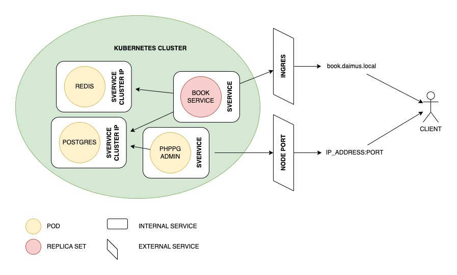
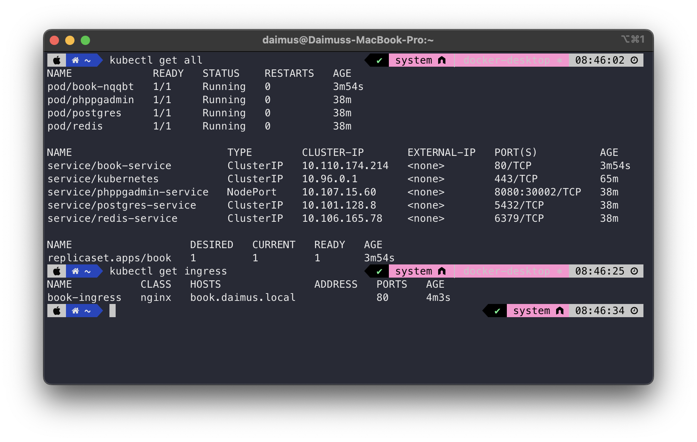
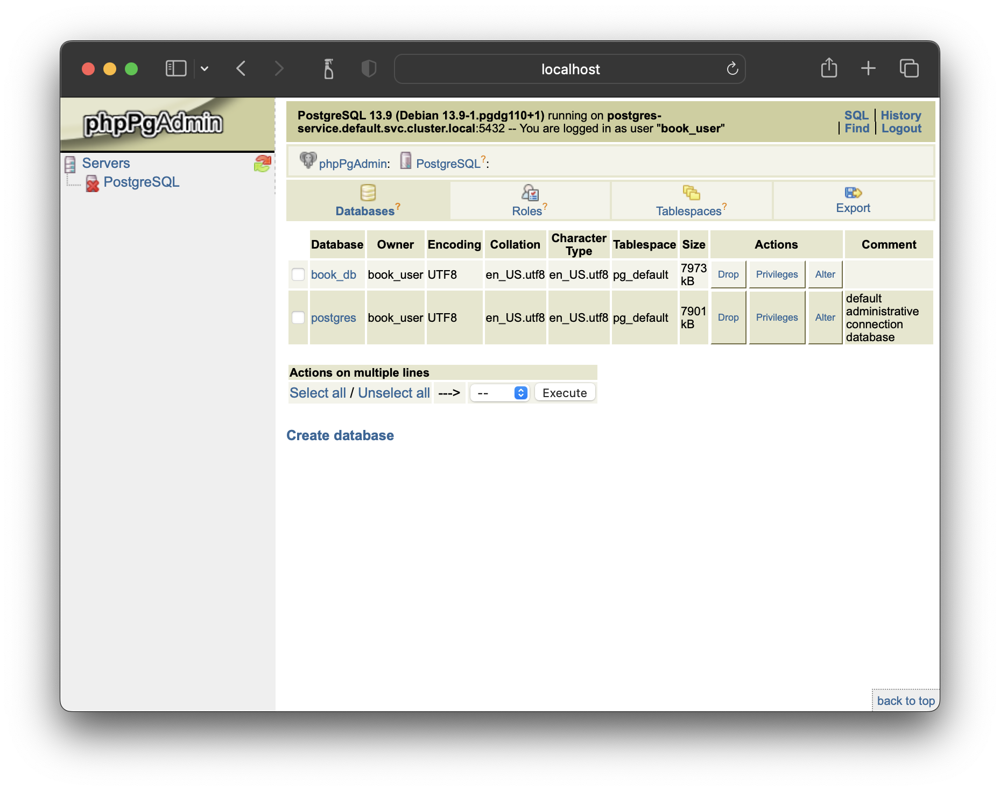
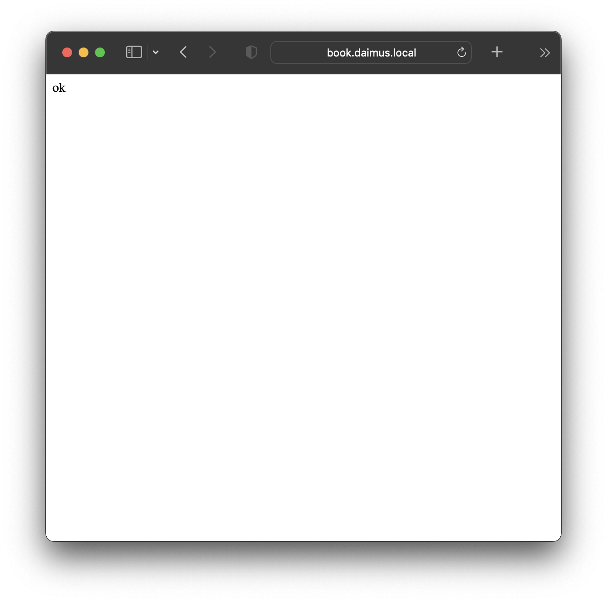
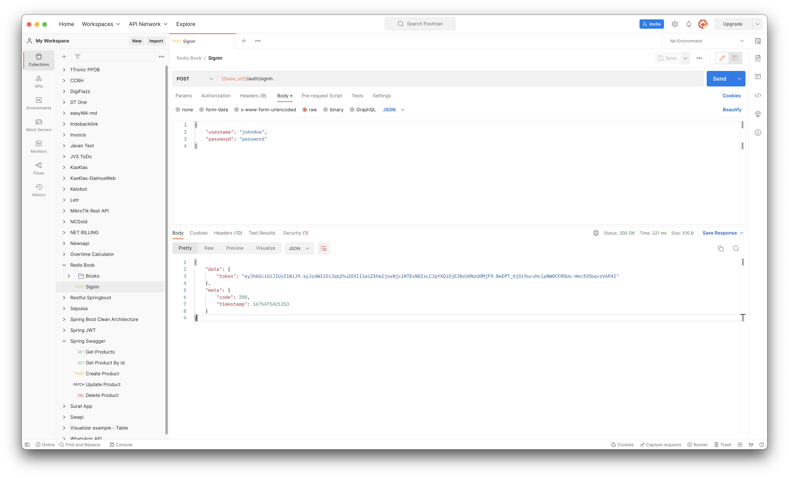

# Day 20-21 - Kubernetes

## Diagram


Pada desain cluster kubernetes, terdapat resource sbb:
1. Pod postgres
2. Pod redis
3. Pod phppgadmin
4. Replica set book

Keseluruhan pod diekspose internal supaya antar pod dapat berkomunikasi. Namun hanya service book dan phppgadmin yang diekspose keluar.
1. Book diekspose menggunakan service ingress sehingga dapat diakses menggunakan domain ``book.daimus.local``
2. Phppgadmin diekspose menggunakan service nodeport sehingga dapat diakses menggunakan ``ip:port``

## Step Instalasi

Apply konfugurasi kubernetes ke kubernetes master

```
kubectl create -f postgres.yml
kubectl create -f redis.yml
kubectl create -f phppgadmin.yml
kubectl create -f book.yml
```



Jika semua pod sudah "Running", service phppgadmin dapat diakses melalui port ``ip:30002``



Sedangkan untuk mengakses service book, terlebih dahulu harus ditambahkan nameserver kedalam file ``/etc/host``

```
127.0.0.1   book.daimus.local
```

Setelah itu service book dapat diakses melalui domain ``book.daimus.local``



